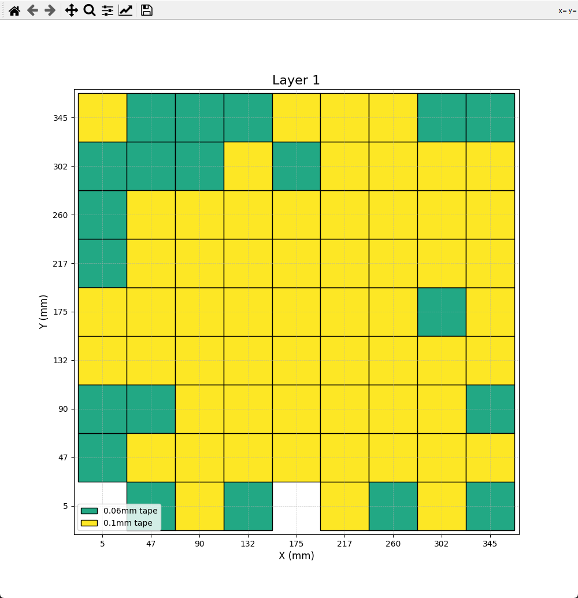
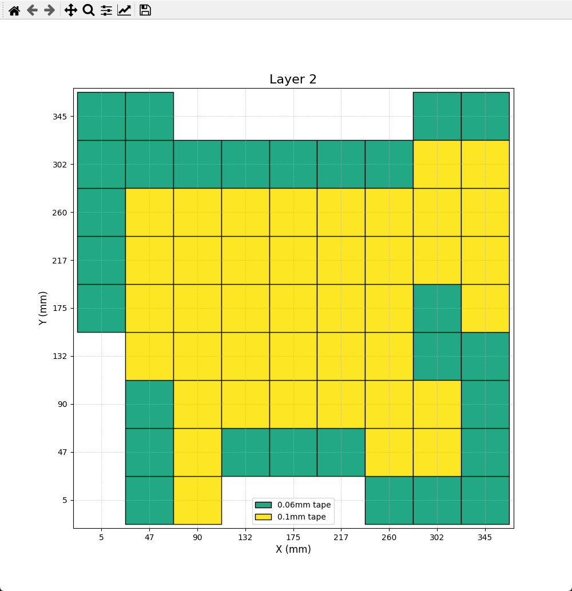
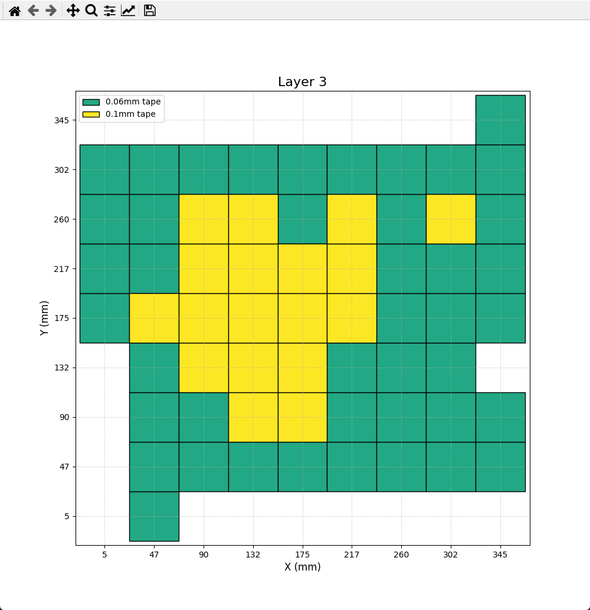
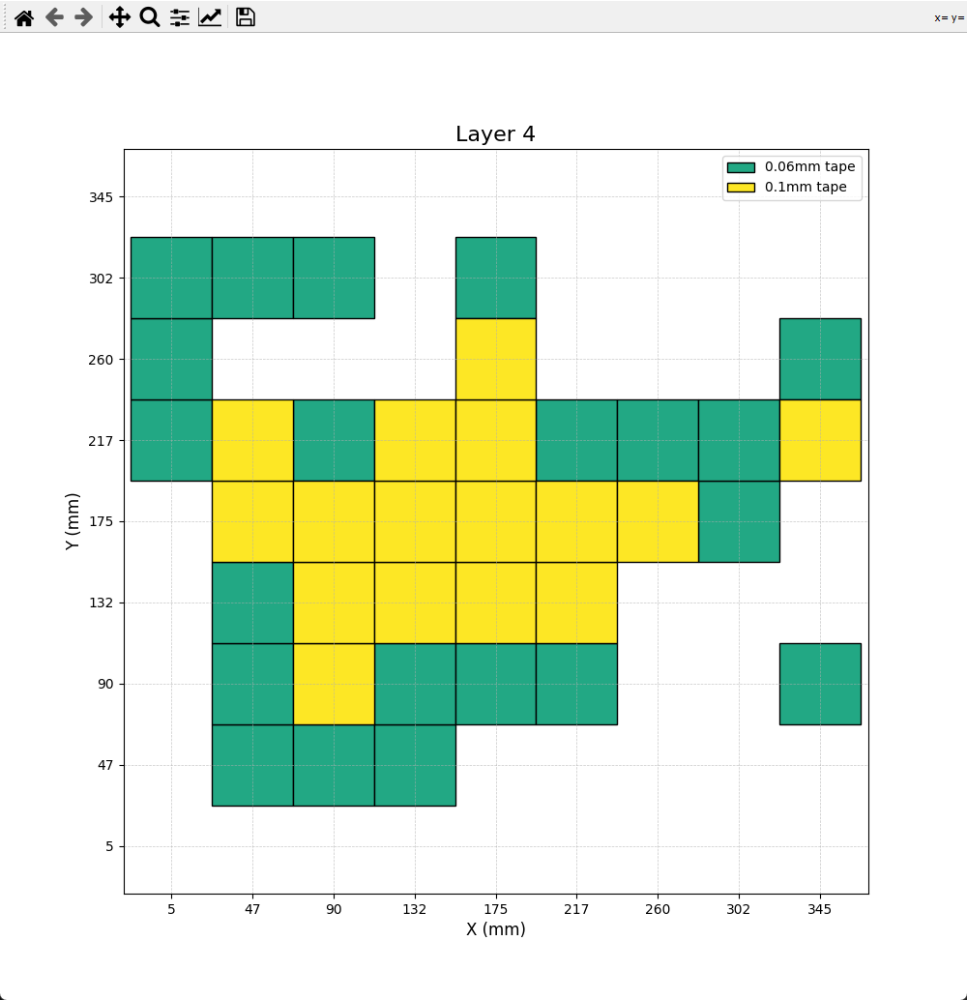

Short Guide how to get your K2 Bed better with some simple tricks!

First i would like to Thank [@JaminCollins](https://github.com/jamincollins) and [@stranula](https://github.com/stranula) for providing the needed Tools for it.

Lets begin by rooting your K2 ( **assuming you already have a mesh created with preheated bed! if not, preheat and heat soak your bed for 10 Minutes at a minimum of 60c and do a fresh mesh!** ):
- Go to your Display
- Go into the Settings and tick the Root Box, wait 30 Seconds and click okay!

Now you are able to add extra Stuff to your K2 and make it a bit better 😄

Now for the first thing to do
- ensure you've used the tools in this repository to install at minimum the **SCREWS_TILT_CALCULATE**
- now go to your Fluidd webUI and home all
- after all is homed, click on tools and click `SCREWS_TILT_CALCULATE`

The Printer now will go from bed screw to bed screw and will give you a popup on your Fluidd with instructions wich knob under the bed you have to turn in what direction and how far ( the 00:00 numbers are clock like! 00:30 means 30 minutes / half an hour -> **half a turn** )
After you moved the knobs in the direction shown click on retry. do it as often as you need to get near to **00:00 to 00:05**

As soon as you are done with your `SCREWS_TILT_CALCULATE` copy the Python File in this folder to your Computer.

**Note: This Python Tool needs to be executed on your PC not the K2!**

**For Informations how to run a Python Script on your PC please use Google and follow the Installation Guide for Python on Windows, Linux and Mac.**

Open the File and Edit it.
- In Line 23 within** tape_thicknesses = [0.125]** you need to add the Thickness of the Aluminum Tape you bought! For me it was 0.125mm. If you have one with 0.125 and one with 0.300 for example to this: **[0.125, 0.300]** to let the Script use a combination of both!
- In Line **9 to 18** you have to enter your Mesh Numbers ( **you can find them on the bottom of your Printer.cfg tho** )
Now you are good to go!

As soon as you can run the Python Script it will show you pictures, like these:

 Showing where and how to place Aluminum Tape on your Bed ( **Not on the Plate!! on the BED!! **)

- Try to get your aluminum tape stripes at around 41mm in width. length is the length of your bed tho

**Note: try to get your aluminum tape as flat as possible!**

Now its time to do a new mesh assuming you have done all layers of Aluminum Tape on your bed.

Your new Mesh should be way better now. Dont forget to rerun the `SCREWS_TILT_CALCULATE` to check for changes due to you taping.

Now try printing a first layer!

**( As for every Modification: Use it at your own risk! no support given for broken stuff after doing modifications.. )**
