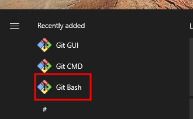
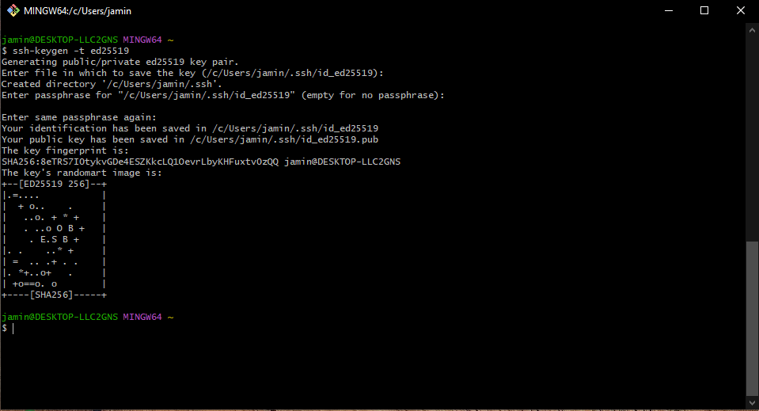
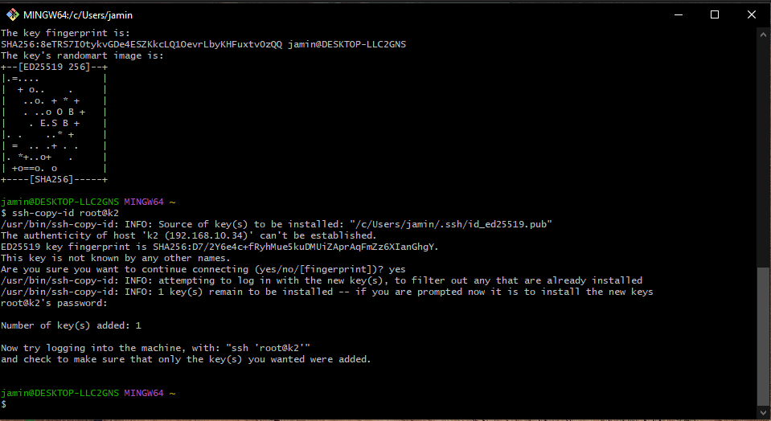

# Key Based Authentication

## Install

Download and install `git`.  Either the **Standalone Installer** or **Portable**:

* [https://git-scm.com/downloads](https://git-scm.com/downloads)

Alternatively you can use a one of the package management tools such as:

* [winget tool](https://docs.microsoft.com/en-us/windows/package-manager/winget)
* [chocolatey](https://chocolatey.org/install)

## Key generation

Start **Git Bash**



Generate a key:

```sh
ssh-keygen -t ed25519
```



Leave the file path at default (press Enter).

For the passphrase, you may leave this blank if you desire.  If you do enter a passphrase, you will need to remember (and enter) the passphrase in order to use this key.

Confirm your previous choice by either leaving it blank again or re-entering the same passphrase again.

## Setting up authentication

In order to use the key for ssh authentication we need to put the _public_ portion fo the key onto the K2.  Replace _k2_ in the following with the printer's hostname or IP address.

```sh
ssh-copy-id root@k2
```



This will likely ask you about the K2's ssh fingerprint.  Validation of system ssh fingerprints is beyound the scope of this documentation, for now it is safe to simply accept this by typing `yes` and pressing _Enter_.

At this point you'll be asked for the root users password, enter it. Note: you will _not_ see characters as you type the password.

## Usage

At this point you should be able to authenticate to the K2 with your ssh key rather than a password.  Replace _k2_ in the following with the printer's hostname or IP address.

```sh
ssh root@k2
```

If you put a passphrase on your key at generation you will likely be asked to enter it each time you attempt to use the key.

## Verification

Now from your system (git bash) try to run this:

```sh
ssh -o PreferredAuthentications=password root@k2
```

This tries to `ssh` with only password authentication.  If the installation succeeded without error, the above should not work
